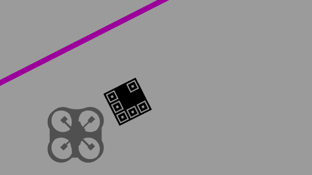
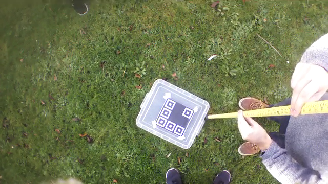
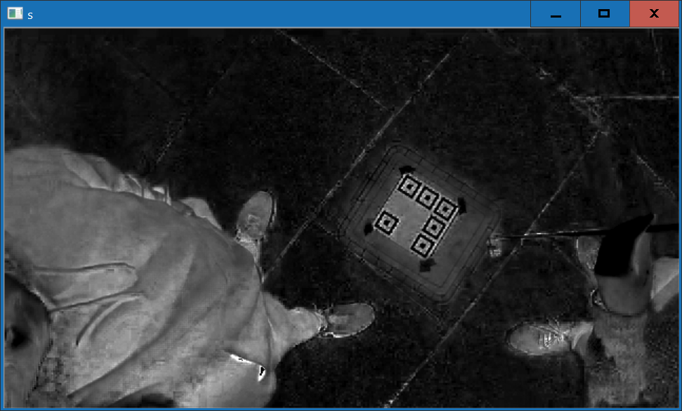
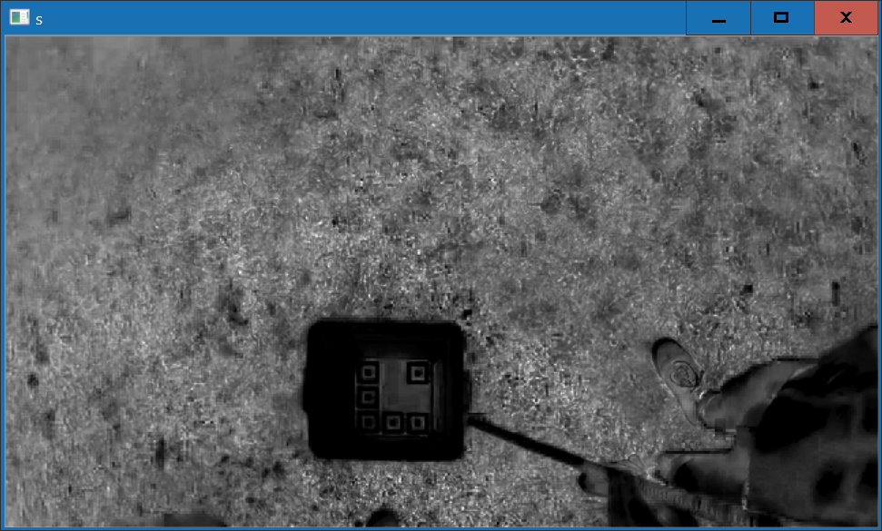

# Image Filtering

## Introduction

### What is image filtering and why do we need it?

Image filtering refers to the removal of useless elements from the image, so that there is less to analyse when looking for the Roomba, Pen and arena boundaries. It was first required when testing outside above grass, where the presence of so many individual blades of grass caused the edge detection and contour detection to take far too long, and seriously hinder the performance of the rest of the program.
What ideas did we have for image filtering?
While some ideas were thought of before implementation began, many of the techniques used were created as the understanding of the problem and the number of example images increased. Initially we tried using a Gaussian blur to blur the grass, but the clarity of the marker was too badly impacted to make this a viable option. The full list of example images used for testing can be found SOMEWHERE TODO.

### Important definitions

- BGR – Stands for Blue Green Red. This is the way OpenCV represents colour images by default. It is the reverse of the standard Red Green Blue (RGB) colour image representation which may be more familiar to the reader.
- HSL – Stands for Hue Saturation Lightness. This is an alternative way to represent colour images, where colour is defined with a Hue value between 0-360, a Saturation value between 0-255 and a Lightness value between 0-255.
- Hue is a value to show where a colour is on the spectrum of light, with increasing values representing red, orange, yellow, green, blue, indigo, violet, and back to red.
- Saturation is the vibrancy of a Hue (complete desaturation is a pure greyscale colour).
- Lightness is the value to show how light or dark a pixel is (0 lightness is pure black, 1 lightness is pure white).
- Frame is used in this document to mean a single image taken from the drone’s video feed.

## The process

### Initial solutions

Before coding began, we had a fairly poor understanding of the whole problem. We made the incorrect assumption that because we would be using a black and white pattern to identify the Roomba and the Pen, any areas of the image with a saturation above 0 would not be a pattern. This held true within the simulator, but in reality, the black ink used to print the patterns was not pure black.

After realising this, another assumption was made that the black ink would be the darkest part of an image, because even if it wasn’t pure black, it was still black in colour, and therefore dark. This led to the first solution implemented in code, which was to assign each pixel a value of ‘low’, ‘mid’ or ‘high’ and filter out the ‘mid’ and ‘high’ values, leaving only the ‘low’ pixels. However, we were aware that looping over every pixel in a high-definition image would be too computationally expensive, so we decided to split each image into segments (called regions) and perform less intensive sampling on each region.

### Regions and sampling

An input frame is split up into an input number of rows and columns (by default this is nine rows and sixteen columns). Nine evenly-spaced pixels are then selected from each region to be used for sampling. Various attributes are sampled depending on the method of image filtering used.
The number of rows and columns to create on the frame is variable. There were two reasons for this decision:

1. It would allow us to more cleanly experiment with the ideal number of rows and columns while we attempted to optimise the settings – more regions may result in a cleaner image, but also increases the processing time.
2. We were aware that some environments might require different forms of processing, and therefore may be better suited to having more or fewer rows and columns.

The sampling performed varies depending on which image filtering methods are called. The methods are detailed in the section below.

### Methods

Three methods were implemented in an attempt to reduce the data as much as possible, not all of which were successful. Below we have described each method in chronological order, explaining our thought process for the method before and during implementation.

#### Lightness filtering

The first method to be implemented involved defining two thresholds on the HSL Lightness scale, so that the regions of the image could be classified as being ‘low’, ‘mid’ or ‘high’ lightness. At first, this method seemed to be logical – the black ink should mean that any region with a marker in would be classified as low lightness. However, it did not work if shadows were present in the image, meaning its real-world performance was very poor, frequently filtering out areas with useful pixels. Later, a variable threshold approach was tried, where the min and max lightness of the image were used to decide what the thresholds should be, but this did not really affect performance.

#### Contrast filtering

This method samples greyscale pixels along the top and bottom, and greyscale pixels along the left and right sides, and compares the average lightness. If the difference is greater than a supplied threshold (default 60) the region is marked as an area of high contrast. This method was implemented for two reasons; firstly, the markers are black and white, so they should contain high contrast. Secondly, if a region contains some of a marker and some background, there should be high contrast there as well. However, this method also frequently removed useful pixels, and so was not used.

#### Red/Green colour filtering

This is the only method which ended up being used. It only keeps regions which fall within the blue region of the HSL Hue scale, or which are greyscale (saturation of 15% below). Red and green areas are removed. The reasoning behind this is that the markers should appear black and white (greyscale) in ideal conditions, but that the black ink can appear to be blue under bright light. This method is very effective at removing large swathes of the image, and never once removed any useful pixels during testing. Clearly this method would not work under a red or green light, but that would never occur under natural conditions.

##### Images showing difference in saturation under different lighting conditions

###### High saturation

###### Low saturation

#### Final use

Although efforts were made to combine these three methods into a single function which could be run, the attempts were not successful, and so the Red/Green colour filter is the only one used. This did lead to a noteworthy improvement in performance when used above grass, but it was still too slow for practical use. Shortly after these tests were done, development focus switched purely to the simulator, and work stopped on the image filtering code.

## Future improvements

There are two changes which could be implemented immediately which could improve the effectiveness of this module.
Firstly, the red/green filter could be run multiple times, with the remaining regions being reduced in size each time to increase the precision of the filter. Efficiency should remain high, because the smaller regions being created would not take up the entire image, as the previous filter should have removed major areas of the image.
Secondly, the contrast filtering method could be improved by comparing the k lightest pixels with the k darkest pixels, instead of sampling an average from the edge, though this might impact performance. This might more accurately find the contrast within a marker. This method would have to be run after the red/green filter, otherwise mid-tone green grass would be the same colour as the mid-tone blue marker ink.