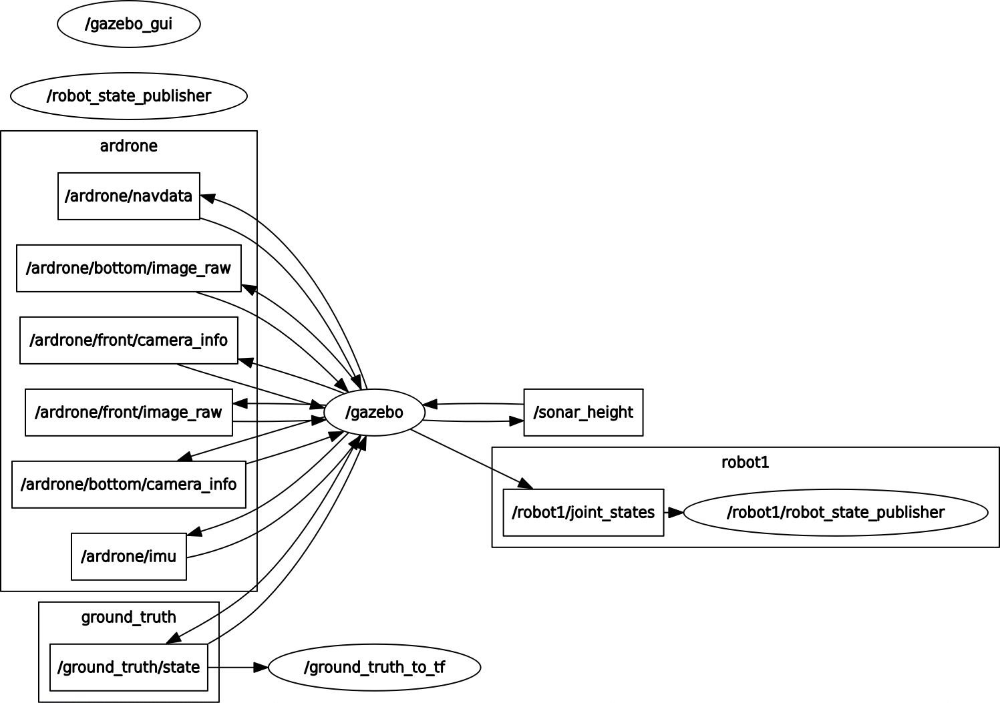

# ROS messages

## Ardrone

Ardrone autonomy is the ROS driver we use to interface with the AR drone. The messages it publishes along with their content are defined as follows:

### Published queues

* ardrone/navdata - general navigation data.
    - battery reading
        - float32 batteryPercent
    - magnometer readings
        - int32 magX
        - int32 magY
        - int32 magZ
    - pressure sensor
        - int32 pressure
    - temperature sensor
        - int32 temp
    - wind sensors
        - float32 wind_speed
        - float32 wind_angle
        - float32 wind_comp_angle
    - roation readings
        - float32 rotX
        - float32 rotY
        - float32 rotZ
    - estimated altitude
        - int32 altd
    - linear velocity
        - float32 vx
        - float32 vy
        - float322 vz
    - linear accelerations
        - float32 ax
        - float32 ay
        - float32 az
    - motor commands
        - uint8 motor1
        - uint8 motor2
        - uint8 motor3
        - uint8 motor4
    - timestamp
        - float32 tm
* ardrone/navdata_time.
* ardrone/mag - magnometer readings.
    - Vector3 vector
* ardrone/odometry - an estimation of a position and velocity in free space.
    - geometry_msgs/PoseWithCovariance pose
    - geometry_msgs/TwistWithCovariance twist
* ardrone/front/image_raw - image feed from drone's 720p front camera.
    - sensor_msgs/Image image
* ardrone/bottom/image_raw - image feed from drone's 360p bottom camera.
    - sensor_msgs/Image image

The message queues we are particularly interested in are 'ardrone/navdata',  'ardrone/front/image_raw' and 'ardrone/back/image_raw'. The 'image_raw' message queues are used to read images from the drones cameras ('ardrone/front/image_raw' is used when we use the drone in real life and 'ardrone/bottom/image_raw' is used in the simulator). The navdata message queue allows us to get various useful bits of information about the drone, including monitoring any rotational or vertical drift, magnometer readings and so on.

### Subscribed queues

The message queues that the ardrone subscribes to are as follows:

* ardrone/takeoff - Publishing a message to this queue causes the drone to take off.
    - std_msgs/Empty
* ardrone/land - Publishing a message to this queue causes the drone to. __Note__: Publishing a land message will not 
overwrite any movement commands previously sent to the drone, this can result in unexpected behaviour such as diagonal downward movement.
    - std_msgs/Empty
* ardrone/reset - Publishing a message to this queue causes the drone to enter emergency mode. __Note__: Publishing to this message queue does nothing in the simulator, if you publish to this queue in real life the drone will immediatley stop everything.
    - std_msgs/Empty
* cmd_vel - Used to publish movement commands to the drone.
    - geometry_msgs/Twist

We will be publishing to all of these message queues.

## Roomba (robot1)

As we do not read any information from the roomba during the execution of our software we do not need to subscribe to any roomba related message queues.

When working in the real world we also do not need to publish to any message queues as the roomba is communicated with via serial, however in the simulator we control the roomba via ROS and must publish messages to one message queue:

* robot1/mobile_base/commands/velocity - Movement commands are sent to the simulated roomba via this queue.
    - geometry_msgs/Twist 

## Example ROS message queue diagrams

Message subscribers/publishers in simulator with AR drone and roomba (robot 1):

Message subscribers/publishers in simulator with our software running:

The nodes produces by our software are:
* co600_master
* roomba_movement
* navdata_coordination_server
* image_server

