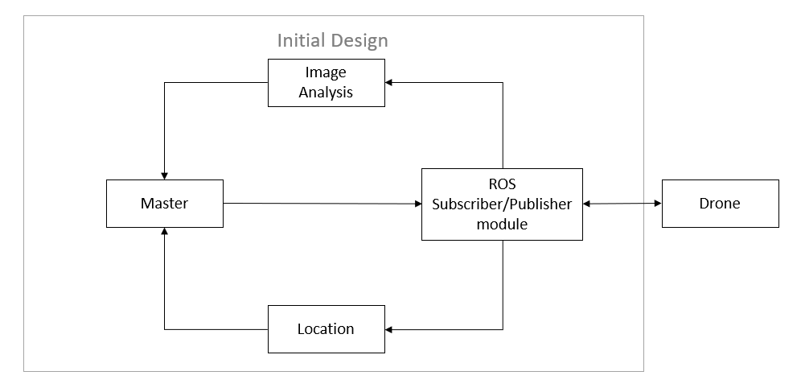
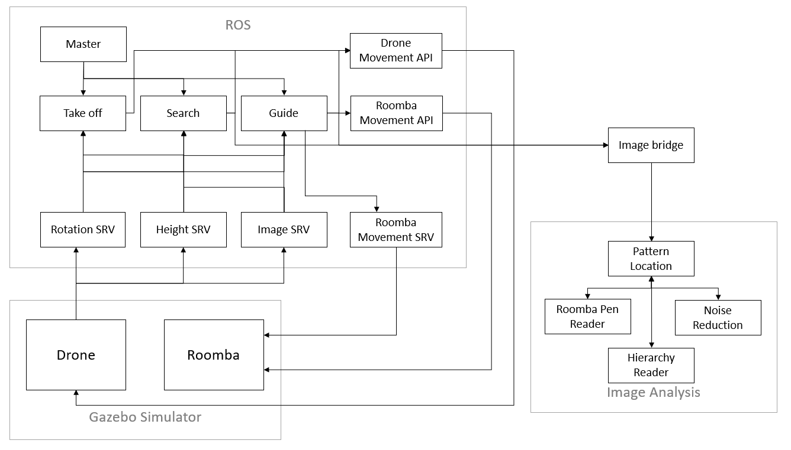

# ROS

The ROS part of the project contains these modules:

* 'master' - Responsible for initialising the different components of the project.
* 'TakeOff' - Responsible for ensuring the drone takes off properly and reaches the correct height.
* 'search' - Responsible for moving the drone until the drone finds the Roomba.
* 'guide' - Responsible for hovering the drone above the Roomba and sending it instructions to get to the pen.
* 'movementApi' - Responsible for creating messages and publishing them to appropriate drone message queues.
* 'NavdataCoordinator' - Responsible for launching two ROS services which can be called to get information about the drone's orientation.
* 'ImageSub' -  Responsible for launching one ROS service which can be called to get the last image received from the drone.
* 'RosUtils' - Utility functions, converts ROS images into OpenCV compatible images.
* 'roombaIdle' - Responsible for launching one ROS service which publishes random movement commands to the Roomba when called the service stops publishing.
* 'roombaMovementApi' - Responsible for creating messages and publishing them to appropriate Roomba message queues.
* 'keyboardTeleop' - Allows control of the drone via keyboard.
* 'Hover' - Responsible for hovering drone over marker __NOT USED__.

## Initial planning

Our initial design (seen below) was very simple, we planned to have three major components or "pillars":

* ROS - Containing a master node and a subscriber/publisher node. The master node would be in charge of deciding how to move the drone based on data given by the image analysis and location components. The subscriber/publisher node would be responsible for publishing movement commands to the drone and subscribing to the various message queues the drone publishes too, these subscribers would pass the data recieved from the drone to the other components. For example, the image subscriber would pass any image received from the drone to the image analysis component.
  
* Image analysis - Should identify the Roomba and pen aswell as arena boundaries.

* Location - Should track the drones location, ensuring it stays on the intended path and understands where the safe area or 'pen' is for the Roomba.



This initial design had three major flaws:

* Two sources of truth for the master node. The master node in charge of deciding which messages to publish has information coming from two separate components, and these components may not provide data simultaneously meaning either the master node has to wait for both to finish their operations or to publish incorrect/naive movement messages.

* Naive callback implementation means we act on every message received. In our initial design we faced the problem of messages 'backing up', if we had a complex operation to carry out on the content of a message, some complex image analysis for example we can end up processing out of date messages, which means we will execute movement commands on bad data.

* The master node needs to execute all stages of the project and became a large monolithic module.

## Solutions

In order to reduce the monolithic nature of the master node we split the work into three new modules:

* TakeOff - Issues takeoff command to the drone and makes sure it reaches an appropriate height with no rotational drift.
* Search - Moves the drone around the arena until we find the Roomba. Currently we have two successfully implemented search patterns and one proposed.
* Guide - Hovers the drone above the Roomba and issues movement commands to move the Roomba back to the safe area or pen. Currently we have two successful implementations of Guide, one is naive and uses the arena boundaries to navigate back to the pen and the second uses the coordinate the roomba is at and the coordinate of the pen to move the roomba to the pen.

The problem of having "two sources of truth", was solved by combining the ROS and location components of our system. Both Search and Guide keep an approximation of the drone's location. This means we only need to call one external component, which is the image analysis component.

The problem "Naive callback implementation" had a few potential solutions:

1. Compare the timestamp of all message processed and only act on messages that are within an appropriate timeframe and ignore all the rest.
2. Implement some ROS "microservices" that will keep track of messages we are interested in.

We chose the second approach as even when we consider timestamps of messages, in order to properly execute movement commands we need data from several message queues meaning we will still have an issue with getting all the correct data at the correct time.

The "microservice" implementation makes use of ROS's services which when called will return a message containing some data. The services we have implemented for this project are:

* Rotation SRV - Subscribes to the 'navdata' message queue and when called returns the most recent value for rotation it has recieved.
* Height SRV - Subscribes to the 'navdata' message queue and when called returns the most recent value for height it has recieved.
* Image SRV - Subscribes to the appropriate camera feed (dependent on simulator or real life) and when called returns the most recent image it has recieved.

After the implementation of the services, the workflow for publishing a movement message becomes:

For takeoff:

1. Request height offset value, using this calculate z axis movement required.
2. Request rotation offset value, using this calculate z rotation required.
3. Publish movement message with these values.

For search:

1. Get X and Y movement required (part of search functionality).
2. Request height offset value, using this calculate z axis movement required.
3. Request rotation offset value, using this calculate z rotation required.
4. Publish movement message with these values.

For guide:

1. Get X and Y movement required from image analysis.
2. Request height offset value, using this calculate z axis movement required.
3. Request rotation offset value, using this calculate z rotation required.
4. Publish movement message with these values.

### Rotation srv message definition

The message definition for rotation srv:
```
---
int64 rotation
```
Rotation srv expects an empty request message and returns a message of int64 type.

### Height srv message definition

The message definition for height srv:

```
---
int64 height
```

### Image srv message definiton

The message definition for image srv:

```
---
sensor_msgs/Image image
```
Image srv expects an empty request message and returns a message of sensor_msgs/Image type.

## Final result

These decisions led to the design seen below. This diagram also includes the modules that interact with the Roomba, such as "Roomba Movement SRV" and "Roomba Movement API".



## What can be improved

The system would be more streamlined if the separate ROS services did not need to be started individually, and could all be started from master.

A better way of tracking movement in the X and Y axes would allow us to more accurately track the current position of the drone, as this is based on an approximation.

A more robust implementation of search and guide would improve the success rate of the software, some edge cases are present where search locates the Roomba, and by the time Guide has started the Roomba has left the drone's FOV.
