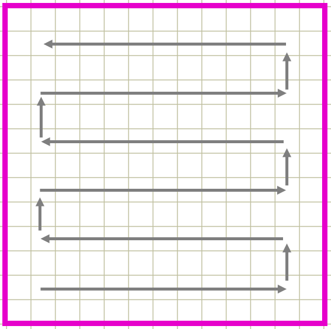

# Search Patterns

We have decided on three different ways to figure out the path of the drone when it starts looking for the Roomba, with the help of some of the research papers we have discovered.

### Lawnmower Pattern

The first pattern we picked is called a lawnmower pattern. This pattern works by moving in a straight line, and will only turn if it comes across a boundary or an object. Once it has reached the end of the arena, it will change its direction from going forwards to going back down towards the pen, and will continue to repeat this until it has found the Roomba. It requires minimal turning hence we considered this was the easiest pattern a drone can follow. It also has a clear direction therefore makes it easier to evaluate its path. As said in the research papers, this pattern is commonly used in not only search and rescue operations but also for geographic planning.

There are many reasons why a lawnmower pattern would be good for this project:

1. Minimal Turns

Because this pattern exerts a small number of turns, its dominant direction is straight. In this way, the search will become faster due to the limited wait in the turning.

2. Drone Drift

Again, due to less turns, it would (even if just a little) require fewer from error correction. Since the error detection deals with the drone's rotation and drift, the decrease in turning would increase the stability and quality of the frames being passed to check whether or not a Roomba or boundary can be seen. This would then create a more reliable result.

3. Area

Lawnmower pattern scans from one boundary to another therefore it scans quite a large section of the arena's width. This means there is a good chance in finding the Roomba due to the size of space that is searched during its movement. 

4. Time

Due to the given size of the arena, the lawnmower pattern works quickly in finding the Roomba. Lawnmower excels in arenas that aren't too large therefore once it has reached the end, it can quickly search the arena again.

### Spiral-like Pattern

The second pattern is called a spiral-like pattern, also mentioned in some of the research papers we found. The search will start by scanning the drone's boundaries (both in x and y direction) to get an estimation of the arena's parameters in the form of units. It will then fly to the Rooomba's last known location, given as co-ordinates, and then start to spiral outwards from that point. If it comes across a boundary, it will stay beyond it and continue its calculated path. Once it knows it has seen all four corners of the boundaries, it will start to spiral inwards until it has reached the middle of the arena, and then spiral outwards again. It will continue in this loop until it has found the Roomba.

The spiral-like pattern is more complex than the lawnmower because it requires a lot more turns than lawnmower. It also requires a greater understanding of the drone's relative position as we need to know what co-ordinates we are at. Furthermore spiral patterns are usually restricted in sweeping over areas that are already visited therefore we thought this would be a nice challenge to solve.

In comparison to the lawnmower pattern, the spiral-like pattern's advantages are as follows:

1. Improved Guide Module

Because the spiral-like pattern is able to return the drone and Roomba's current co-ordinates, it allowed us to improve the guidance module of the process, which is what happens when the drone finds the Roomba. Using the co-ordinates, we are able to rotate the Roomba towards the correct angle in relation to the pen and then drive it forward until it reaches the pen.

2. Scaling Abilities

The spiral-like pattern scales well when it comes to the size of the arena. Although the lawnmower would be faster for smaller arenas, the spiral-like pattern excels in larger ones as it can search larger areas and navigate from one section to another in a smaller amount of time.

3. Faster Success Rate

Since we have decided to use the Roomba's last known location it will move outwards from that location and then start searching the area around it before it has to spiral inward again (when it is seeing every boundary). Because of this, the chances of the drone finding the Roomba is increased.

4. Future Development

The spiral pattern can easily accomodate for future development. One example is that if it is used for finding groups of people who are lost in a specific area, by using the last known location it can efficiently find most of them (as humans tend to stick together). In this way, spiral works well due to the nature of its path as it has the ability to trace patterns.

### Quadrant Search

The third pattern works by splitting the arena into four sections and calculating which quadrant to search first using the Roomba's last known location. It will do a lawnmower pattern in that specific section and once it has reached the other end, will go back to the middle of arena to do the same lawnmower pattern for a different section.

The advantages for this pattern are:

1. Larger Arenas

Similar to the spiral-like pattern, this search pattern will work extremely will with very large arenas. Since the lawnmower path is best for smaller arenas, the fact that the large arena can be split up into smaller sections will mean a faster way to search using lawnmower, especially with the knowledge of the Roomba's last known location. In this way, the quadrant search can be easily applied to real-life searches.

2. Predictable

This search pattern can greatly benefit from a system that can easily predict movement of a lost unit. This is because the quadrants can be searched in a specific order depending on the likeliness of appearance.
