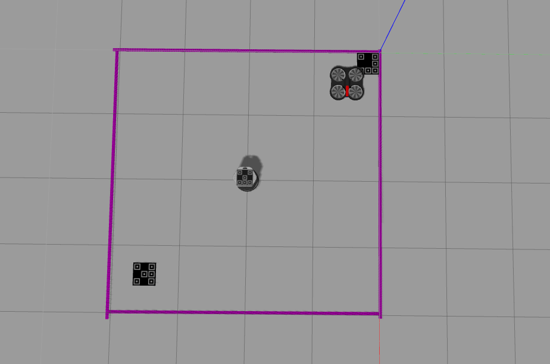

# Gazebo simulator

As testing our work in the real world is time consuming and inconvenient we need a tool that allows us to test/demonstrate our software.

The 'tum_simulator' (https://github.com/tum-vision/tum_simulator) allows us to simulate an Ardrone and control/read from it via ROS. Unfortunately the distribution of ROS that we are using (kinetic 1.12.14) is not supported by the 'tum_simulator' so we have to use a fork found here: https://github.com/angelsantamaria/tum_simulator.

## Running the simulator

1. Install the dependency 'ardrone_autonomy' - 'apt-get install ros-kinetic-ardrone-autonomy'
2. Clone the packages in the 'tum_simulator' into your 'catkin_ws'.
3. Build packages using command 'catkin_make'.
4. Launch an instance of ros master using command 'roscore'.
5. Launch basic simulation world with command 'roslaunch cvg_sim_gazebo ardrone_testworld.launch'.
6. Launch our simulation world with command 'roslaunch cvg_sim_gazebo ardrone_4x4invert.launch'.

## Changing simulator worlds

The example worlds provided with 'tum_simulator' were more than adequate to help us get started with ROS and controlling the drone. Using the basic worlds we are able to:

* Test moving the drone.
* Test reading from the drone's camera.
* Insert markers into the worlds, and test the success rate of the image analysis with these markers.
* Test hovering the drone over the markers.

However in order to test more complex functionality we needed to be able to change the simulated world. Our requirements to fully test our project were:

* A world containing an arena marked on the ground. More information about the arena can be found in the arena choice document.
* A second robot (the Roomba) being added to the world that we can communicate with via ROS.
* The ability to add a marker to the second robot to allow the drone to recognise it.

Changing or creating a new world in Gazebo is relatively easy, the work required is just to create the models of whatever we want in the world. As all we required were markers on the ground (arena boundaries and safe area indicator) this was a relatively simple task.

Adding the second robot proved to be significantly more challenging. As there are no readily available models for the iRobot Roomba that we are were using in real life we decided to use a model for a turtlebot, these robots move in a similar manner. The Turtlebot model we are using is 'kobuki_hexagons_asus_xtion_pro'. The main difficulty we faced when adding this robot to the simulator was ensuring there were no "colliding" namespaces with the ROS message queues, for example, most robots subscribe to the 'cmd_vel' message queue to get their movement commands, and we need a way to publish movement commands to the drone and turtlebot individually.

The normal solution for this issue is to provide a namespace prefix for each robot that is spawned in Gazebo, this means that each ROS queue the robot subscribes/publishes now contains that prefix, allowing for unique queue names. This solution cannot be applied in full to our simulation, because in order for the drone to operate properly (and to not immediately crash after takeoff) there is other software subscribing to messages published by the drone, and if we change the names of the queues this software breaks.

The solution we've used is a partial implementation of the namespace solution, where we provide a unique namespace only for the turtlebot. This solution works for our needs (where we only need 2 robots to be simulated), but if we needed to simulate a second drone this would not be practical.

Finally in order to add the marker to the turtlebot we simply had to edit the model and add the image to the top.

The result of this is our simulated arena:

## Advantages and disadvantages

### Advantages

* The simulator provides us with a convenient way to test our work.
* The simulation errors cause drift in a somewhat realistic way, allowing us to test with some form of drift present.
* The simulator allows us to change the arena to suit our needs.

### Disadvantages

* The simulation errors produce a different drift to that of real life.
* Work that works in the simulator may not have the same effect in real world.
* There is no latency in communicating with the drone in the simulator unlike the real world.
* The images returned by the drone in the simulator are much more simple than those returned in real life (we didn't predict the overhead that the more complex image analysis would cause).
* Work is done specifically for the simulated world or for the real world (i.e communication with turtlebot via ROS and communication with Roomba via serial).
