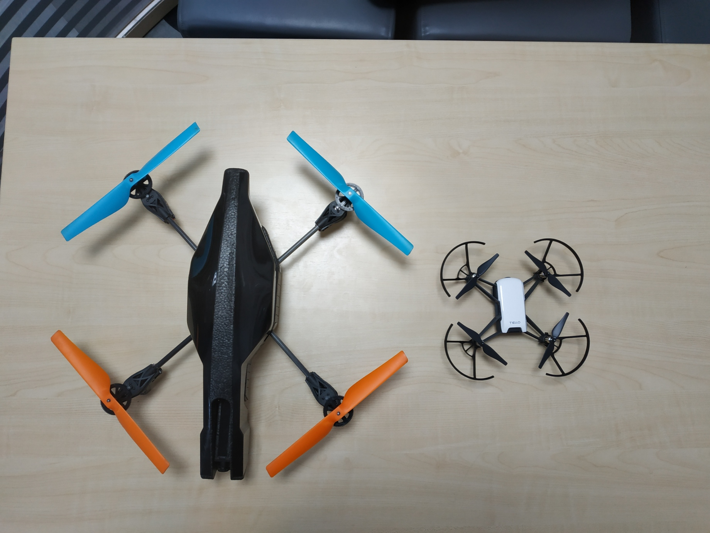

# Tello drone

The Tello drone was proposed as an alternative for the AR drone 2, that was significantly smaller (the dimensions of the AR drone are: 420mm x 420mm x 110mm, the dimensions of the Tello drone are 180mm x 180mm x 45mm) and would allow us to test inside more conveniently. The Tello drone is also much better at hovering with minimal drift in the x and y axes. The drone however does not have a bottom facing camera, so with the help of The Shed an attachment was 3d printed that allowed a mirror to be placed on the front camera.

A comparison of the two drones:

As there is significantly less support for the Tello drone and ROS there was no well maintained equivalent of Ardrone autonomy (The ROS driver we use to communicate with the AR drone). The driver we planned on using can be found here: https://github.com/anqixu/tello_driver

One work item valued at 3 points (3-5 days work) was allocated to investigate adding support for the Tello drone to our current codebase. This investigation revealed that unfortunately this driver does not provide an equivalant of the NavData message that Ardrone autonomy provides, which means that whilst we can execute a very naive implementation of our software, we cannot perform error correction, or read any important data from the drone other than the camera feeds. Because of this the idea to use the Tello drone has been abandoned.
