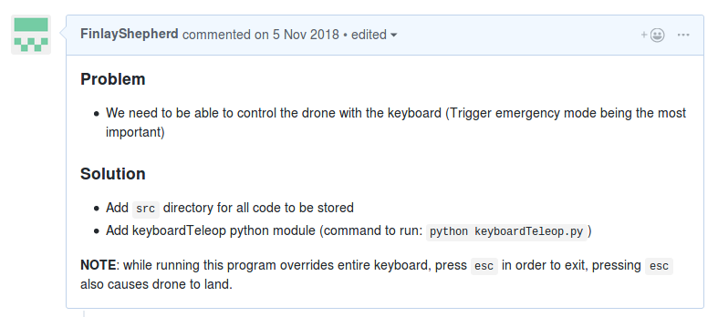
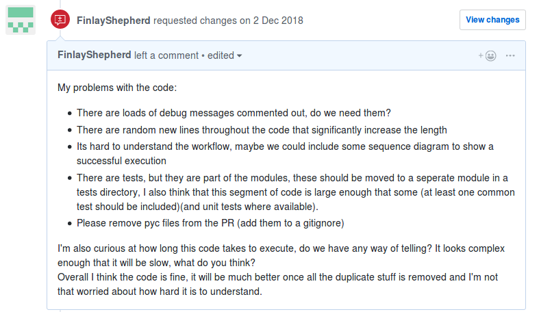

# Github

Github provides us with a convenient tool that allows us to store our documents and source code, solve version control issues and allow us to work in parallel on the same code base.

Our github repository can be found at: https://github.com/NJRBailey/co600-roomba-herding

## Github workflow

We work with one Github repository, each team member has their own fork, which they will use for their own development. Once a work item has been completed it will be merged with the master branch of our main repository.

When a new work item has been assigned in Trello the process of adding it to Git is as follows:

1. Create a new branch from master.
2. Develop locally until the work is considered finished.
3. Push to personal remote branch.
4. Create a pull request from personal remote branch to master branch.
5. Request review from another team member.
6. The reviewer must ensure that the work meets our standards and makes sense (Example of reviews can be found below).
7. If reviewer requests changes fix any issues and re-review.
8. Once reviewer approves changes 'squash and merge' the pull request.

## Commits

Github commits should be self explanatory to allow us a better understand of changes made.

Messages such as "Commit #1" or similar should be avoided, messages such as "Added method X" or "Fix error x" are preferable.

## Pull requests

Once a piece of work is finished it should be pushed to a remote branch, then a pull request should be made from the remote branch to our master branch. After the pull request has been created assign another team member to review it.

A pull request should be made to the master branch of our repository when a piece of work is considered "finished", when creating the pull request assign another team member to review it. When creating a pull request it should be formated as so:

### Example pull request:

 The reviewer's job is to check the work to make sure it looks like it achieves what is outlined in the problem statement and make sure there are no obvious mistakes in the work. Once the reviewer gives approval the pull request can be merged to the master branch using the "Squash and merge" button.

### Example pull request review:

We use "Squash and merge" as it still allows us the ability to revert changes made in pull requests, but also ensures that our master branch's history is not full of potentially useless commits which could make reverting some changes more difficult.